# Podstawy Programowania Obiektowego

*******************************************************************
Zadanie rozgrzewkowe - Powtórka ze struktur
*******************************************************************

Prosta "baza danych" - etap 1

    Zaproponuj strukturę o nazwie Student opisującą studenta. 
    Przyjmij, że student posiada następujące cechy: imię, nazwisko, płeć, nr pesel i nr indeksu.
    Wczytaj z klawiatury dane studenta i umieść je w strukturze.
    Napisz funkcję o nazwie `display_student()`.
    Parametrem wywołania tej funkcji jest referencja na strukturę opisująca studenta.
    Funkcja wyświetla na ekranie wszystkie pola tej struktury
    Stwórz tablicę studentów i wypełnij ją dowolnymi danymi bez wczytywania czegokolwiek z klawiatury
    Napisz funkcję o nazwie `display_all_students()`.
    Ta funkcja ma dwa argumenty - pierwszym z nich jest tablica studentów, drugim - liczba studentów.
    Funkcja wyświetla dane wszystkich studentów (korzystając ze zdefiniowanej
    wcześniej funkcji `display_student()` )

Prosta "baza danych" - etap 2

    Zaproponuj strukturę o nazwie BazaStudentow reprezentującą bazę studentów.
    Przyjmij, że ta struktura zawiera: 100-elementową tablicę studentów oraz informację o
    liczbie studentów w bazie. Napisz funkcję o nazwie find_student().
    Funkcja ma 2 argumenty: bazę studentów oraz poszukiwany numer indeksu studenta.
    Funkcja przeszukuje bazę studentów w poszukiwaniu osoby o podanym numerze indeksu
    i zwraca jej położenie lub -1 jeśli poszukiwanego studenta nie ma.
    Napisz funkcję add_student(), której zadaniem jest dodanie do bazy nowego studenta.
    Jakie powinny być argumenty wywołania tej funkcji? Co powinna zwracać?
    Napisz funkcję remove_student(), której zadaniem jest usunięcie studenta z bazy
    Napisz funkcje load_students() oraz save_students() które wczytują/zapisują dane studentów z/do pliku

*******************************************************************
1. Zakładamy konto na github zgodnie z instrukcją: https://education.github.com/pack
2. Pobieramy i instalujemy CLion: https://poradnik.napwr.pl/oprogramowanie
3. Generujemy token do połączenia z github: https://github.com/settings/tokens
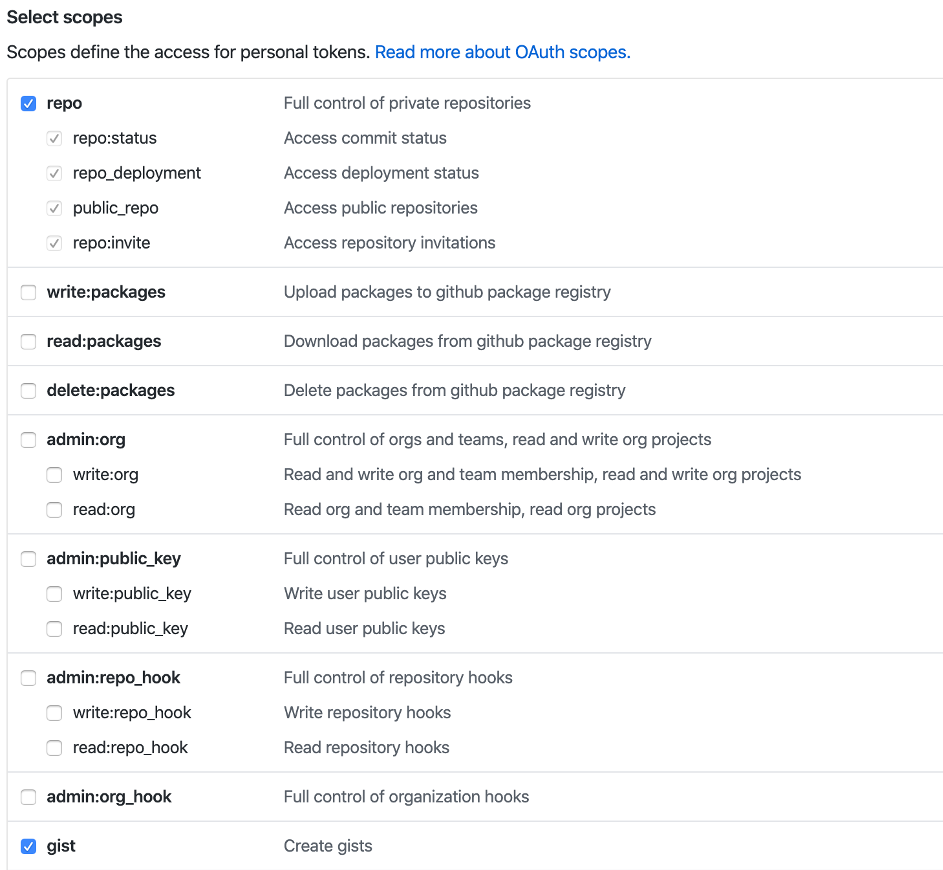

4. Robimy forka projektu
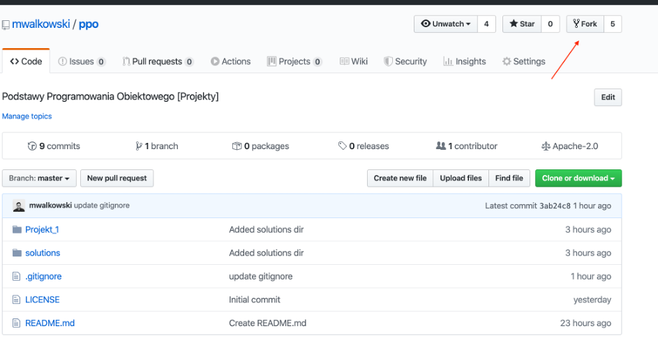

5. Uruchamiamy Clion i wybieramy repozytorium do sklonowania
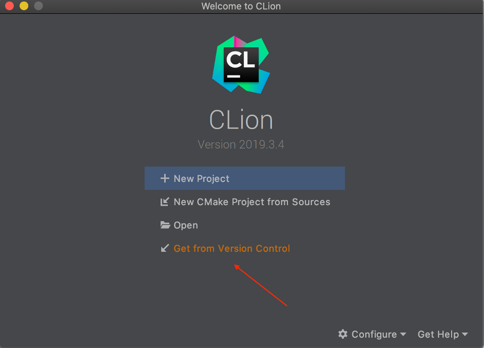

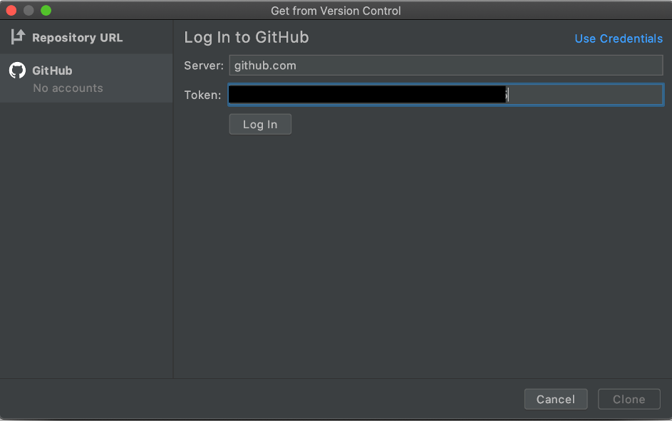

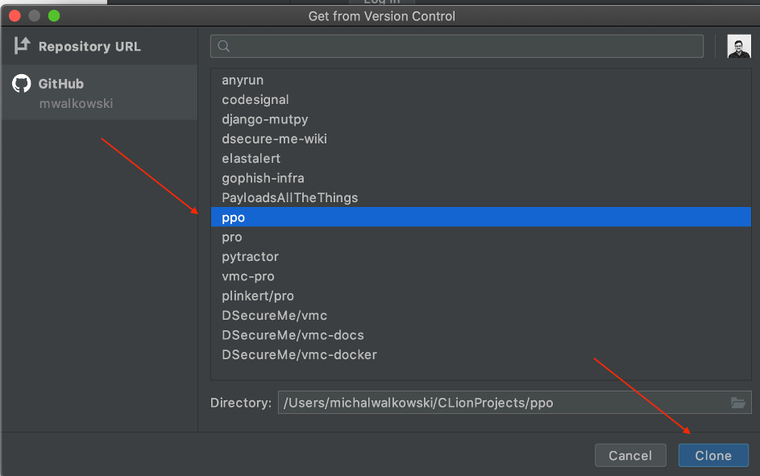

6. Rozwiązania do zadań rozgrzewkowych umieszczamy w podkatalogu solutions/<nazwa użytkownika z gihuba> (np. solutions/mwalkowski lub solutions/ireenkaaa), termin do: `12.03`
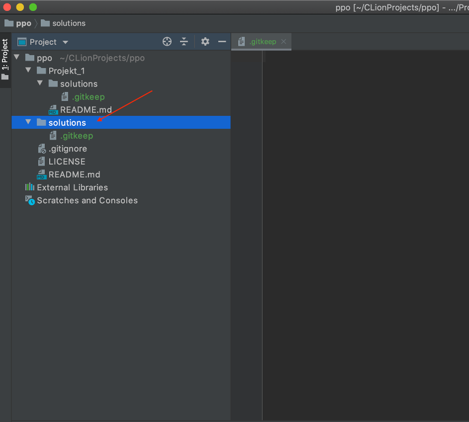

7. Nad Projekt_1 pracujemy w katalogu Projekt_1/solutions/<nazwa użytkownika z github>
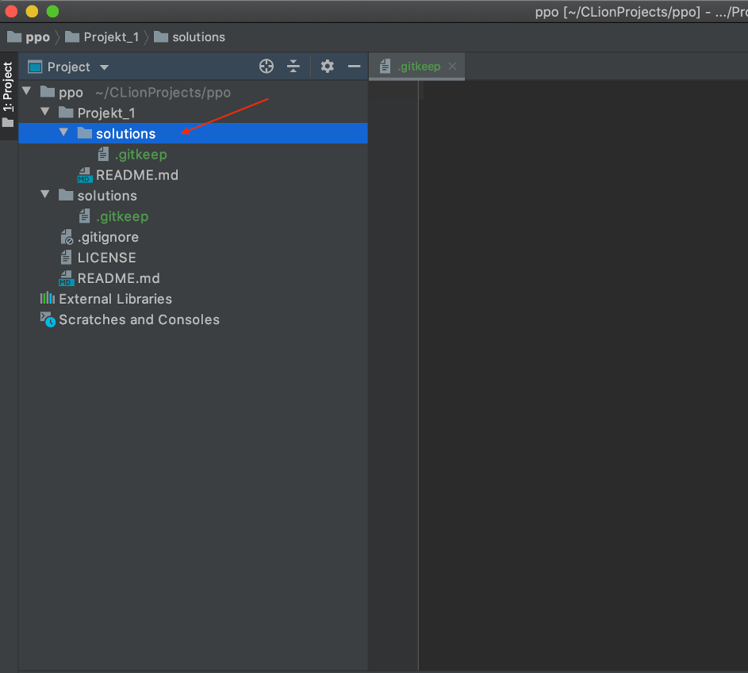

8. Wysyłanie zmian na serwer github:
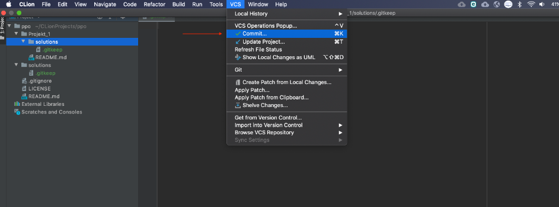

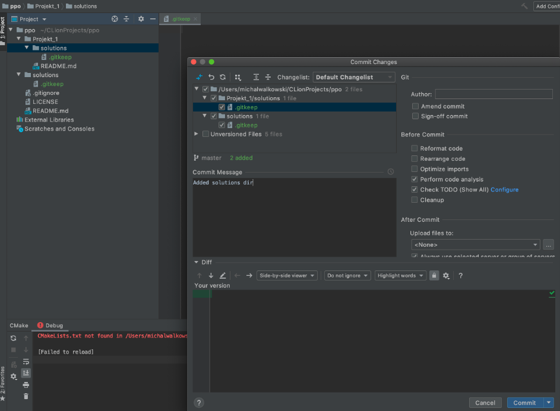

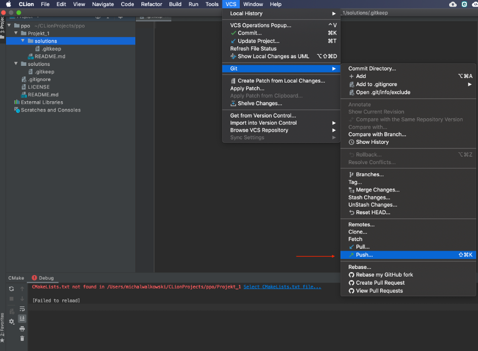

*******************************************************************
Oddawanie programów odbywa się za pomocą tak zwanego Pull Request. W tym celu wybieramy na swoim forku

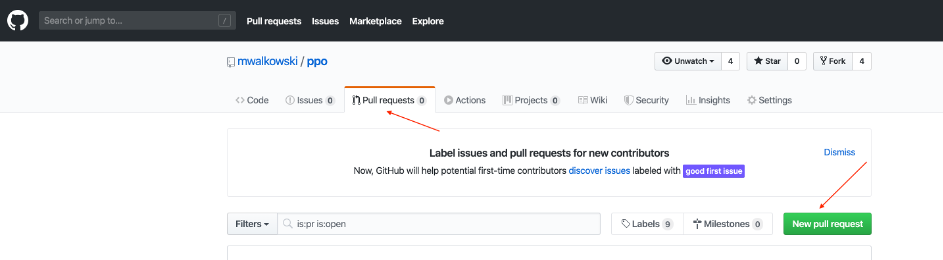

*******************************************************************
Oddawanie programów odbywa się za pomocą tak zwanego Pull Request. W tym celu wybieramy na swoim forku
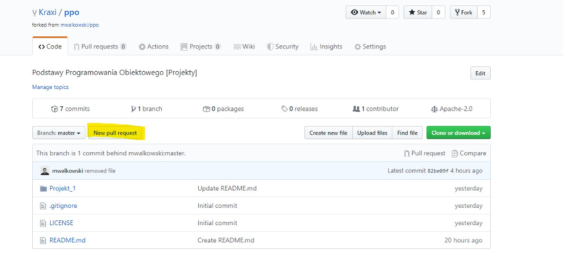

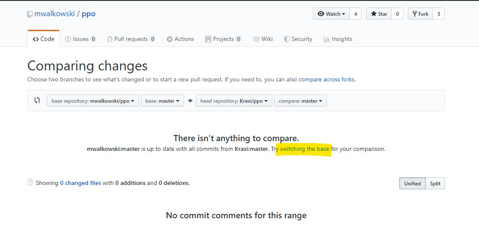

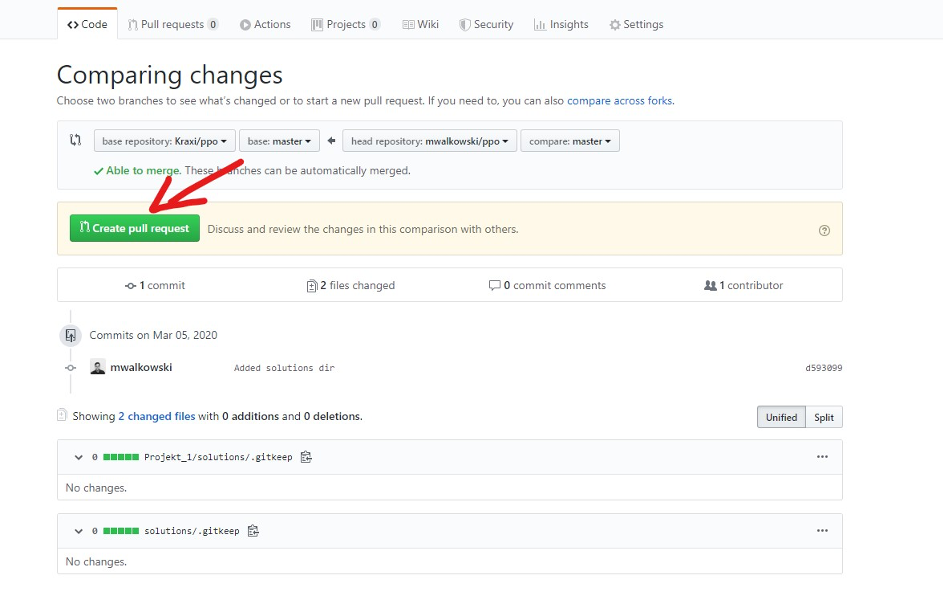

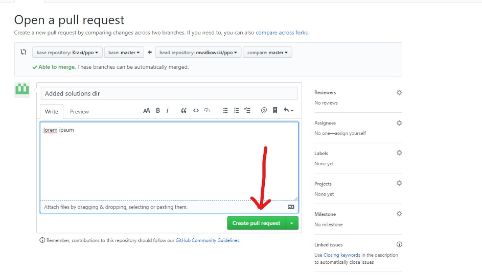

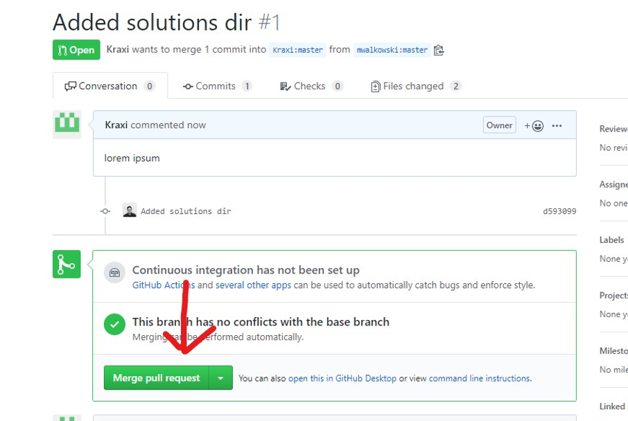